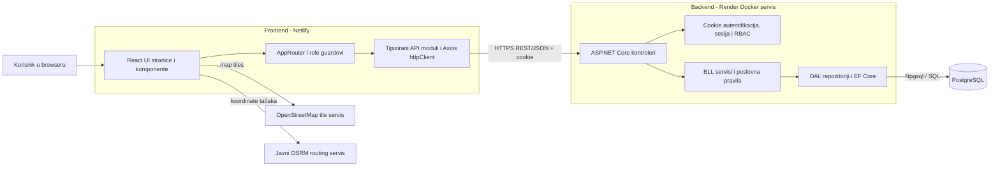

# Architecture / Technical Overview

**Projekat:** PostRoute - sistem za optimizaciju ruta punjenja i pražnjenja poštanskih sandučića

**Tim:** Grupa 11

**Stanje dokumenta:** Finalna verzija sistema, Sprint 11

---

## 1. Pregled arhitekture

PostRoute je web aplikacija organizovana kao modularni monolit sa odvojeno deployanim frontend, backend i baznim servisom:

- **Frontend** je React SPA koji se u produkciji servira sa Netlifyja.
- **Backend** je ASP.NET Core REST API organizovan kroz API, BLL, DAL i Domain projekte, a deploya se kao Docker kontejner na Render.
- **Baza** je PostgreSQL. Lokalno se pokreće kroz Docker Compose, dok se produkcijska konekcija zadaje backendu kroz environment varijablu.
- **Vanjski map servisi** su OpenStreetMap za kartografske pločice i javni OSRM servis za iscrtavanje putanje između tačaka.

Frontend ne pristupa bazi direktno. Svi poslovni podaci prolaze kroz backend API, poslovni servis i repozitorij.

| Dio sistema | Tehnologije | Glavna odgovornost |
| --- | --- | --- |
| Frontend | React 19, TypeScript 6, Vite 8, React Router 7 | Korisnički interfejs, navigacija po ulozi, forme, mape i pozivi prema API-ju |
| Backend API | ASP.NET Core 9 | HTTP endpointi, autentifikacija, autorizacija, validacija i mapiranje odgovora |
| Poslovni sloj | C# BLL servisi | Poslovna pravila za korisnike, sandučiće, rute, probleme i izvještaje |
| Data access | Entity Framework Core 9 + Npgsql | Repozitoriji, mapiranje entiteta, upiti i migracije |
| Baza | PostgreSQL 16 | Trajna pohrana korisnika, sandučića, ruta, problema i audit zapisa |
| Mape i rutiranje | Leaflet, React Leaflet, OpenStreetMap, OSRM | Odabir koordinata, prikaz sandučića i vizuelno iscrtavanje ruta |
| Deployment | GitHub Actions, Netlify, Render, Docker | Automatski build, testiranje i isporuka aplikacije |

---

## 2. Dijagram sistema



U lokalnom okruženju frontend radi na Vite development serveru, backend na Kestrelu, a PostgreSQL u Docker kontejneru na host portu `5433`.

---

## 3. Frontend struktura

Frontend se nalazi u [`PROJEKAT/frontend`](../PROJEKAT/frontend) i podijeljen je prema tehničkoj odgovornosti:

| Folder | Sadržaj |
| --- | --- |
| [`src/ui`](../PROJEKAT/frontend/src/ui) | Stranice, layouti i zajedničke React komponente |
| [`src/application`](../PROJEKAT/frontend/src/application) | Aplikacijski hookovi, uključujući provjeru prijavljenog korisnika |
| [`src/infrastructure/api`](../PROJEKAT/frontend/src/infrastructure/api) | Centralni HTTP klijent i API moduli za korisnike, sandučiće, rute i probleme |
| [`src/infrastructure/routing`](../PROJEKAT/frontend/src/infrastructure/routing) | Definicija ruta i frontend provjere pristupa po ulozi |
| [`src/infrastructure/config`](../PROJEKAT/frontend/src/infrastructure/config) | Čitanje `VITE_API_BASE_URL` konfiguracije |
| [`src/shared`](../PROJEKAT/frontend/src/shared) | Dijeljeni tipovi i pomoćne funkcije |

Glavni funkcionalni frontend moduli su:

- **Autentifikacija:** prijava, odjava, provjera trenutnog korisnika i obavezna promjena inicijalne lozinke.
- **Korisnici:** kreiranje i pregled poštara.
- **Sandučići:** unos, izmjena, pretraga, filtriranje, statusi, radni dani, vremenski prozori i historija promjena.
- **Rute:** generisanje, ručno preuređivanje, dodjela poštaru, praćenje i arhiva.
- **Terenski rad:** prikaz dodijeljene rute i evidentiranje realizacije ili nedostupne lokacije.
- **Problemi i notifikacije:** pregled problema, komentari, dodjela akcije i zatvaranje problema.
- **Izvještaji:** učinak poštara i realizacija po tipu sandučića.
- **Mapa:** Leaflet prikazi sa OpenStreetMap podlogom i OSRM putanjom.

[`httpClient.ts`](../PROJEKAT/frontend/src/infrastructure/api/httpClient.ts) centralizuje HTTP komunikaciju. Axios koristi `withCredentials: true`, pa browser uz cross-origin zahtjeve šalje autentifikacijski cookie backendu.

---

## 4. Backend struktura

Backend solution se nalazi u [`PROJEKAT/backend`](../PROJEKAT/backend) i sastoji se od četiri produkcijska projekta:

| Projekat | Odgovornost |
| --- | --- |
| [`PostRoute.Api`](../PROJEKAT/backend/src/PostRoute.Api) | Pokretanje aplikacije, kontroleri, API ugovori, CORS, autentifikacija i middleware |
| [`PostRoute.BLL`](../PROJEKAT/backend/src/PostRoute.BLL) | Poslovni servisi, komande, modeli i pravila sistema |
| [`PostRoute.DAL`](../PROJEKAT/backend/src/PostRoute.DAL) | `AppDbContext`, EF Core entiteti, repozitoriji i migracije |
| [`PostRoute.Domain`](../PROJEKAT/backend/src/PostRoute.Domain) | Dijeljene domenske vrijednosti, uključujući korisničke uloge |

### Glavni backend moduli

| Modul | API kontroler | BLL servis | Podaci |
| --- | --- | --- | --- |
| Korisnici i autentifikacija | `UsersController` | `UserService` | `User`, `SecurityLog` |
| Sandučići | `MailboxesController` | `MailboxService` | `Mailbox`, `MailboxAuditLog` |
| Rute i izvještaji | `RoutesController` | `RouteService` | `Route`, `RouteItem` |
| Problemi na terenu | `IssuesController` | `IssueService` | `Issue`, `IssueComment`, `IssueStatusHistory`, `IssueNotification` |

Kontroleri ne pristupaju `DbContext` objektu direktno. Oni pozivaju BLL interfejse, BLL koristi repozitorije, a repozitoriji izvršavaju EF Core operacije nad PostgreSQL bazom. Dependency injection registracije nalaze se u `ApiServiceRegistration`, `BllServiceRegistration` i `DalServiceRegistration` klasama.

### Generisanje rute

`RouteService.GenerateRouteAsync` implementira MVP heuristiku:

1. Učitava aktivne sandučiće.
2. Filtrira ih prema radnom danu, prioritetu i datumu posljednjeg uključivanja u rutu.
3. Obrađuje visoki, srednji i niski prioritet tim redoslijedom.
4. Unutar istog prioriteta bira najbližu dostupnu lokaciju.
5. Provjerava vremenske prozore i računa procijenjeno vrijeme dolaska.
6. Ograničava rutu na najviše 50 tačaka i sprema `Route` i `RouteItem` zapise.

Ovaj algoritam ne koristi stanje saobraćaja i nije matematički optimalan; namijenjen je MVP obimu sistema.

---

## 5. Baza podataka

Centralna konfiguracija modela nalazi se u [`AppDbContext.cs`](../PROJEKAT/backend/src/PostRoute.DAL/AppDbContext.cs). Najvažnije grupe podataka su:

- **Users / SecurityLogs** - korisnici, uloge, zaključavanje naloga i sigurnosni događaji.
- **Mailboxes / MailboxAuditLogs** - lokacije, GPS koordinate, tip, prioritet, dostupnost i historija izmjena.
- **Routes / RouteItems** - plan, redoslijed obilaska, dodjela poštaru, procjene i realizovani statusi.
- **Issues** i povezane tabele - problematične lokacije, komentari, statusna historija, akcije i notifikacije.

EF Core migracije nalaze se u [`PostRoute.DAL/Migrations`](../PROJEKAT/backend/src/PostRoute.DAL/Migrations). Backend pri pokretanju poziva `Database.MigrateAsync()`, tako da se neprimijenjene migracije izvršavaju prije prihvatanja saobraćaja.

Lokalni PostgreSQL 16 servis definisan je u [`docker-compose.dev.yml`](../PROJEKAT/docker-compose.dev.yml). Produkcijska baza se povezuje kroz `ConnectionStrings__DefaultConnection`; stvarni connection string nije pohranjen u repozitoriju.

---

## 6. Komunikacija komponenti

### Prijava korisnika

1. Frontend šalje `POST /api/users/login` sa emailom i lozinkom.
2. `UserService` dohvaća korisnika i BCrypt-om provjerava hash lozinke.
3. Backend u sesiju upisuje ID, email, ulogu i `MustChangePassword` vrijednost.
4. ASP.NET Core izdaje autentifikacijski cookie sa korisničkim claimovima.
5. Frontend poziva `GET /api/users/current-user` radi obnove UI stanja nakon učitavanja stranice.

### Poslovni zahtjev

Tipičan zahtjev prolazi kroz:

```text
React stranica
  -> frontend API modul
  -> Axios httpClient
  -> ASP.NET Core kontroler
  -> BLL servis
  -> DAL repozitorij
  -> PostgreSQL
```

Odgovori se vraćaju kao JSON DTO modeli. Frontend zatim osvježava lokalno stanje i prikaz. Dispečerski dashboard periodično ponavlja dohvat ruta svakih 30 sekundi; sistem ne koristi WebSocket ili SignalR.

### Mape i rutiranje

Map podloga se učitava direktno iz OpenStreetMap tile servisa. Za vizuelnu cestovnu putanju frontend šalje koordinate javnom OSRM endpointu kroz `leaflet-routing-machine`. Ti pozivi ne prolaze kroz PostRoute backend, pa prikaz mape i putanje zavisi od dostupnosti vanjskih servisa i internet konekcije.

---

## 7. Najvažnije sigurnosne odluke

| Odluka | Implementacija |
| --- | --- |
| Hashiranje lozinki | BCrypt; čista lozinka se ne čuva u bazi |
| Zaštita od brute-force prijave | Nalog se zaključava nakon 5 uzastopnih neuspješnih pokušaja |
| Autentifikacija | ASP.NET Core cookie autentifikacija i serverska sesija, trajanje 30 minuta |
| Zaštita cookieja | `HttpOnly`; u produkciji `Secure` i `SameSite=None` zbog odvojenih Netlify i Render domena |
| Autorizacija | Backend RBAC kroz `[Authorize(Roles = ...)]` i `RequiredRole` middleware za uloge Administrator, Dispatcher i PostalWorker |
| CORS | Eksplicitna lista dozvoljenih frontend origin-a uz `AllowCredentials` |
| Audit i sigurnosni log | Bilježe se prijave, odbijeni pristupi i izmjene podataka o sandučićima |
| Tajne | Connection string i deployment vrijednosti dolaze iz environment varijabli i hosting secrets |
| Kontejner | Backend Docker runtime koristi non-root korisnika |

Frontend `PrivateRoute` guard poboljšava korisničko iskustvo, ali nije sigurnosna granica. Konačna provjera prava mora biti na backend endpointu.

### Sigurnosna ograničenja MVP-a

- Cookie autentifikacija koristi `SameSite=None` u produkciji, ali aplikacija nema eksplicitno implementirane anti-CSRF tokene. To treba dodati prije stvarne produkcijske upotrebe.
- Dio read-only endpointa, uključujući dohvat korisnika po ID-u i čitanje sandučića, trenutno nema backend `[Authorize]` zaštitu.
- Session state se čuva u memoriji jedne backend instance; restart servisa prekida sesiju, a skaliranje na više instanci zahtijevalo bi zajednički distribuirani session store.
- Demo korisnici i početne lozinke služe samo za evaluaciju. Produkcijski sistem mora koristiti zasebno upravljanje tajnama i obaveznu promjenu inicijalnih lozinki.

---

## 8. Deployment topologija

| Komponenta | Produkcijsko okruženje | Konfiguracija |
| --- | --- | --- |
| React SPA | Netlify | [`netlify.toml`](../netlify.toml), `VITE_API_BASE_URL` |
| ASP.NET Core API | Render, Docker runtime | [`render.yaml`](../render.yaml), [`Dockerfile`](../PROJEKAT/backend/Dockerfile) |
| PostgreSQL | Managed PostgreSQL servis | `ConnectionStrings__DefaultConnection` na backend hostu |
| Frontend CI/CD | GitHub Actions | [`.github/workflows/frontend-ci.yml`](../.github/workflows/frontend-ci.yml) |
| Backend CI | GitHub Actions | [`.github/workflows/backend-ci.yml`](../.github/workflows/backend-ci.yml) |

Frontend produkcijski URL je [https://postrouteapp.netlify.app](https://postrouteapp.netlify.app). Backend izlaže `/health` endpoint za osnovnu provjeru dostupnosti. Detaljan tok isporuke opisan je u [`ContinuousDeployment.md`](ContinuousDeployment.md).

---

## 9. Gdje se nalazi ključni kod

| Tema | Ključna lokacija |
| --- | --- |
| Pokretanje API-ja, CORS, cookies, sesija i migracije | [`Program.cs`](../PROJEKAT/backend/src/PostRoute.Api/Program.cs) |
| API endpointi | [`Controllers`](../PROJEKAT/backend/src/PostRoute.Api/Controllers) |
| Poslovna pravila | [`BLL/Services`](../PROJEKAT/backend/src/PostRoute.BLL/Services) |
| Algoritam generisanja rute | [`RouteService.cs`](../PROJEKAT/backend/src/PostRoute.BLL/Services/RouteService.cs) |
| EF Core model baze | [`AppDbContext.cs`](../PROJEKAT/backend/src/PostRoute.DAL/AppDbContext.cs) |
| Repozitoriji | [`DAL/Repositories`](../PROJEKAT/backend/src/PostRoute.DAL/Repositories) |
| Migracije | [`DAL/Migrations`](../PROJEKAT/backend/src/PostRoute.DAL/Migrations) |
| Frontend routing i role guardovi | [`AppRouter.tsx`](../PROJEKAT/frontend/src/infrastructure/routing/AppRouter.tsx) |
| Centralni HTTP klijent | [`httpClient.ts`](../PROJEKAT/frontend/src/infrastructure/api/httpClient.ts) |
| Frontend API moduli | [`infrastructure/api`](../PROJEKAT/frontend/src/infrastructure/api) |
| UI stranice | [`ui/pages`](../PROJEKAT/frontend/src/ui/pages) |
| Mape i OSRM integracija | [`ui/components/common`](../PROJEKAT/frontend/src/ui/components/common) |
| Backend testovi | [`backend/tests`](../PROJEKAT/backend/tests) |
| Frontend testovi | [`ui/pages/admin/test`](../PROJEKAT/frontend/src/ui/pages/admin/test) |

Ovaj pregled opisuje stvarno stanje finalne implementacije. Planske odluke iz ranijih sprintova koje nisu završile u kodu, poput JWT autentifikacije, Tailwind CSS-a ili cloud VM/Nginx topologije, nisu predstavljene kao dio finalne arhitekture.
