# PostRoute — Korisnički priručnik (User Manual)

> **Verzija:** 1.0 · **Jezik:** Bosanski · **Sprint:** 11

---

## Sadržaj

1. [Pregled sistema](#1-pregled-sistema)
2. [Korisničke uloge](#2-korisničke-uloge)
3. [Pristup aplikaciji i sistemski zahtjevi](#3-pristup-aplikaciji-i-sistemski-zahtjevi)
4. [Prijava u sistem](#4-prijava-u-sistem)
5. [Testni korisnici (demo kredencijali)](#5-testni-korisnici-demo-kredencijali)
6. [Promjena lozinke](#6-promjena-lozinke)
7. [Početni ekran (Dashboard)](#7-početni-ekran-dashboard)
8. [Administrator — upravljanje sistemom](#8-administrator--upravljanje-sistemom)
9. [Dispečer — planiranje i praćenje ruta](#9-dispečer--planiranje-i-praćenje-ruta)
10. [Poštar — rad na terenu](#10-poštar--rad-na-terenu)
11. [Upravljanje problematičnim lokacijama](#11-upravljanje-problematičnim-lokacijama)
12. [Izvještaji](#12-izvještaji)
13. [Sigurnosne funkcionalnosti](#13-sigurnosne-funkcionalnosti)
14. [Ograničenja sistema i šta korisnik ne može raditi](#14-ograničenja-sistema-i-šta-korisnik-ne-može-raditi)
15. [Često postavljana pitanja (FAQ)](#15-često-postavljana-pitanja-faq)

---

## 1. Pregled sistema

**PostRoute** je web aplikacija za **optimizaciju ruta punjenja i pražnjenja poštanskih sandučića**. Sistem zamjenjuje ručno, iskustveno planiranje obilazaka pametnom optimizacijom ruta koja u obzir uzima geografsku lokaciju sandučića, njihov prioritet, radne dane i vremensku dostupnost.

**Kome je sistem namijenjen?**

Sistem je interni operativni alat poštanske službe, namijenjen:

- **administratorima** koji unose i održavaju podatke o sandučićima i korisnicima,
- **dispečerima** koji planiraju dnevne rute, dodjeljuju ih poštarima i prate realizaciju,
- **poštarima (terenskim radnicima)** koji izvršavaju obilazak i bilježe status svakog sandučića na terenu,
- **menadžmentu** koji kroz izvještaje prati efikasnost i donosi odluke.

**Glavna vrijednost sistema:**

- automatsko generisanje optimalne dnevne rute (heuristika "najbliži susjed" uz poštivanje prioriteta),
- pregled i praćenje realizacije obilaska u (skoro) realnom vremenu,
- evidencija problema na terenu (nedostupne lokacije) i njihovo rješavanje,
- analitički izvještaji o učinku poštara i realizaciji po tipu sandučića.

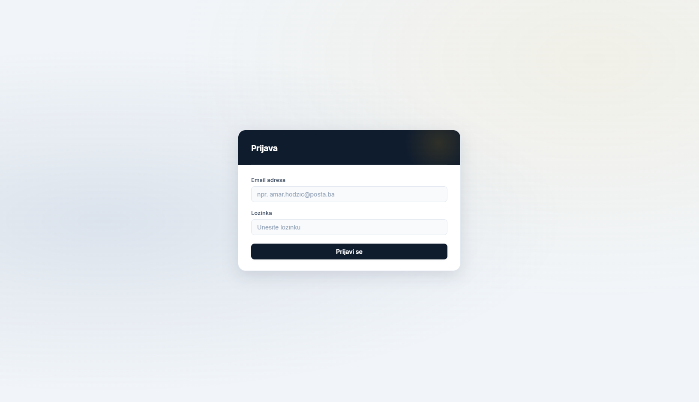

---

## 2. Korisničke uloge

Sistem koristi **kontrolu pristupa zasnovanu na ulogama (RBAC)**. Svaki korisnik ima tačno jednu ulogu koja određuje koje ekrane i akcije vidi. Uloge su međusobno isključive.

| Uloga | Opis | Glavne mogućnosti |
|---|---|---|
| **Administrator** | Potpuna kontrola nad sistemom | Upravljanje korisnicima, upravljanje sandučićima, generisanje i praćenje ruta, svi izvještaji, arhiva |
| **Dispečer** | Operativno planiranje | Generisanje i dodjela ruta, praćenje realizacije, izvještaji, arhiva |
| **Poštar** | Terenski rad | Pregled vlastite dnevne rute, ažuriranje statusa sandučića, prijava nedostupnih lokacija |

> **Napomena:** Korisnici se **ne mogu sami registrovati**. Sve korisničke račune (uključujući poštare i dispečere) kreira administrator.

---

## 3. Pristup aplikaciji i sistemski zahtjevi

PostRoute je **responzivna web aplikacija** — radi u svakom modernom web pregledniku, na računaru i na mobilnom uređaju. Nije potrebna instalacija.

- **Dispečerski i administratorski prikaz** najbolje funkcionišu na računaru (desktop-first), zbog rada s mapama, tabelama i formama.
- **Poštarski prikaz** je prilagođen mobilnom uređaju (mobile-first), jer poštar radi na terenu putem telefona.

**Adresa aplikacije:**

- Produkcijska (live) aplikacija: **https://postroute.netlify.app/login**
- Lokalno pokretanje (za razvoj): `http://localhost:5173`

> Preporučeni preglednici: Google Chrome, Microsoft Edge, Mozilla Firefox (najnovije verzije). Potrebna je aktivna internet konekcija — sistem nema offline način rada.

---

## 4. Prijava u sistem

> Dostupno na: `/login`

Prijava se vrši pomoću **email adrese** i **lozinke**.

**Koraci:**

1. Otvorite aplikaciju — automatski se prikazuje ekran **Prijava**.
2. U polje **Email adresa** unesite svoju registrovanu email adresu (npr. `admin@mail.com`).
3. U polje **Lozinka** unesite lozinku.
4. Kliknite na dugme **Prijavi se**.

**Očekivani rezultat:**

- Sistem provjerava kredencijale i, ako su ispravni, preusmjerava vas na **početni ekran (Dashboard)** prilagođen vašoj ulozi.
- Ako je riječ o prvoj prijavi novokreiranog računa, sistem vas automatski vodi na ekran **Promjena lozinke** (vidi [poglavlje 6](#6-promjena-lozinke)).

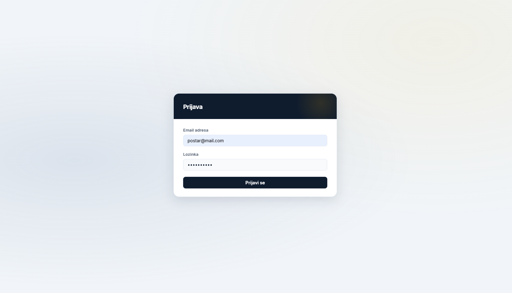

**Mogući problemi i poruke:**

| Poruka | Značenje | Rješenje |
|---|---|---|
| `Neispravni kredencijali. Molimo pokušajte ponovo.` | Pogrešan email ili lozinka | Provjerite podatke i pokušajte ponovo (postoji kratka pauza od nekoliko sekundi prije sljedećeg pokušaja) |
| `Unesite ispravnu email adresu.` | Email nije u ispravnom formatu | Provjerite da email sadrži `@` i domenu |
| `Račun je zaključan nakon više neuspješnih pokušaja.` | Previše neuspjelih prijava | Kontaktirajte administratora da otključa račun |

---

## 5. Testni korisnici (demo kredencijali)

Za potrebe testiranja i demonstracije, sistem pri prvom pokretanju automatski kreira sljedeće demo naloge. Sve demo lozinke su već postavljene, pa ovi nalozi **ne traže promjenu lozinke** pri prijavi.

| Uloga | Email | Lozinka |
|---|---|---|
| **Administrator** | `admin@mail.com` | `Admin123!` |
| **Dispečer** | `dispatcher@mail.com` | `Dispatcher123!` |
| **Poštar** | `postar@mail.com` | `Postar123!` |
| **Poštar (drugi)** | `postar1@mail.com` | `Postar123!` |

> **Napomena:** Demo nalozi postoje radi lakšeg testiranja svih uloga. U stvarnoj upotrebi administrator kreira prave korisničke naloge s vlastitim lozinkama, a preporučuje se promjena ili uklanjanje demo naloga.

---

## 6. Promjena lozinke

> Dostupno na: `/change-password`

Pri **prvoj prijavi** novokreiranog računa, sistem **obavezno** traži promjenu početne (privremene) lozinke prije pristupa ostatku aplikacije.

**Koraci:**

1. Unesite **Trenutnu lozinku** (privremenu lozinku koju vam je dao administrator).
2. Unesite **Novu lozinku**.
3. Ponovite je u polju **Potvrdi lozinku**.
4. Kliknite **Spasi**.

**Pravila za novu lozinku:**

- najmanje **8 karaktera**,
- sadrži najmanje **jedan broj**,
- sadrži najmanje **jedan specijalni znak** (npr. `! @ # $ %`),
- mora biti **različita** od trenutne lozinke.

**Očekivani rezultat:** Prikazuje se poruka *"Lozinka uspješno promijenjena. Dobrodošli!"* i sistem vas nakon kratke pauze preusmjerava na Dashboard.

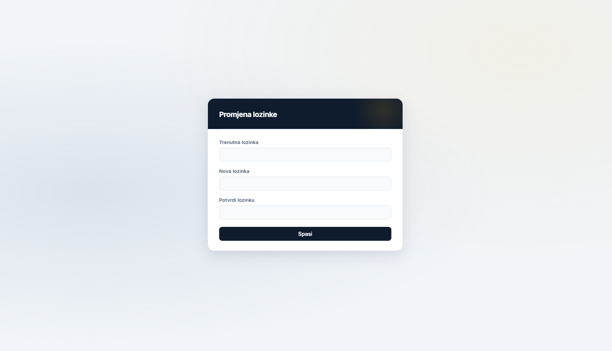

---

## 7. Početni ekran (Dashboard)

Nakon prijave prikazuje se **Dashboard** s pozdravnom porukom (npr. *"Dobrodošli, admin (Administrator)"*) i karticama brzih prečica koje se razlikuju prema ulozi. Na lijevoj strani nalazi se **bočni meni (sidebar)** za navigaciju kroz sve dijelove sistema.

**Administrator** vidi kartice: Upravljanje korisnicima, Pregled sandučića, Generisanje ruta, Praćenje ruta, Učinak poštara, Statistika sistema, Postavke.

**Dispečer** vidi kartice: Generisanje dnevne rute, Praćenje ruta, Učinak poštara.

**Poštar** vidi kartice: Moja današnja ruta, Mapa sandučića, Prijava problema.

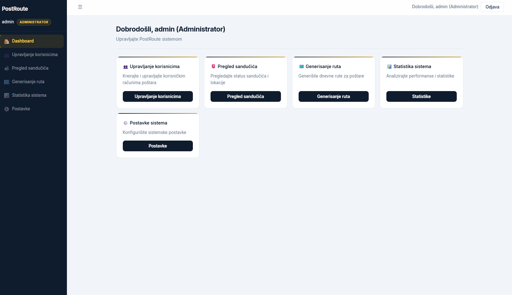

> **Navigacija:** Bilo koju funkciju možete otvoriti klikom na karticu na Dashboardu ili na odgovarajuću stavku u bočnom meniju lijevo.

---

## 8. Administrator — upravljanje sistemom

Administrator ima pristup svim funkcijama sistema. U nastavku su opisani glavni tokovi.

### 8.1 Kreiranje korisničkog računa

> Bočni meni → **Upravljanje korisnicima** → **+ Dodaj korisnika**, ili direktno `/admin/users/new`

**Koraci:**

1. Otvorite formu **Kreiranje korisničkog računa**.
2. Popunite polja:
   - **Ime** i **Prezime** — samo slova, crtica i apostrof (dozvoljena bosanska slova č, ć, š, ž, đ).
   - **Korisničko ime** — najmanje 3 znaka (slova, brojevi, tačka, crtica, donja crtica, @).
   - **Email adresa** — mora biti validna i jedinstvena u sistemu.
   - **Uloga** — odaberite *Poštar*, *Dispečer* ili *Administrator*.
   - **Početna lozinka** — najmanje 8 znakova, jedno veliko slovo i jedan broj. Pokazatelj jačine lozinke prikazuje koliko je lozinka sigurna.
3. Kliknite **Kreiraj račun**.

**Očekivani rezultat:** Prikazuje se obavijest *"Račun uspješno kreiran — korisnik se može prijaviti s privremenom lozinkom."* Korisnik će pri prvoj prijavi morati promijeniti lozinku.

> Ako email ili korisničko ime već postoje, sistem prikazuje grešku uz odgovarajuće polje.

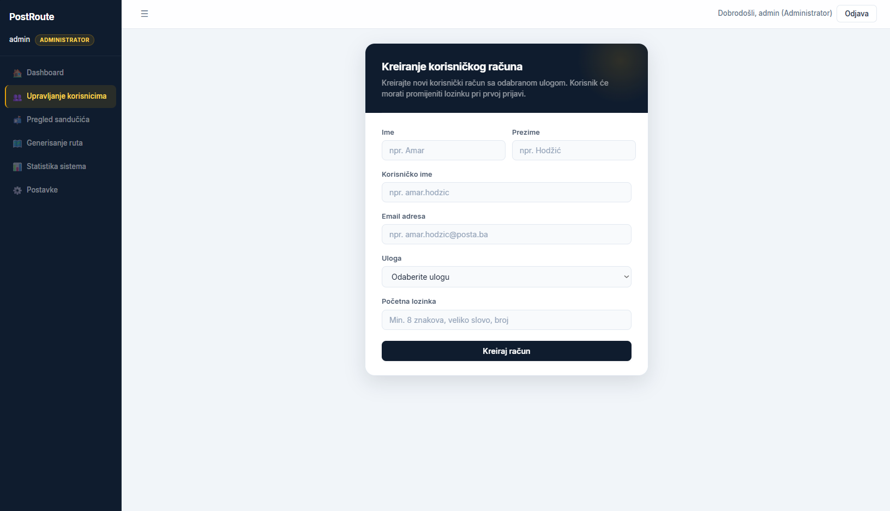

### 8.2 Pregled liste korisnika

> Bočni meni → **Upravljanje korisnicima** (`/admin/users`)

Prikazuje tabelu poštara s kolonama: **Korisničko ime, Email, Uloga, Status**.

- **Status** može biti **Aktivan** (zelena tačka) ili **Zaključan** (crvena tačka).
- Klikom na zaglavlje **Status** lista se sortira tako da su aktivni korisnici prvi.
- Dugme **Osvježi** ponovo učitava listu.

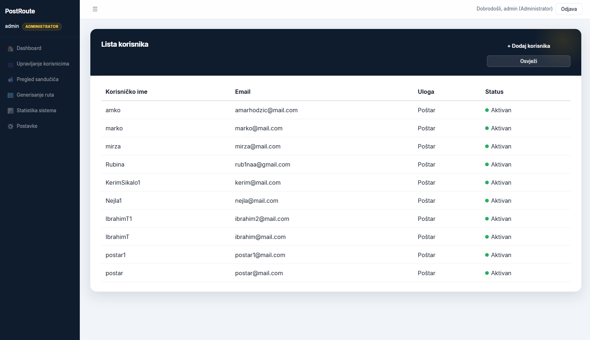

### 8.3 Dodavanje novog sandučića

> Bočni meni → **Pregled sandučića** → **+ Dodaj novi sandučić**, ili `/admin/mailboxes/new`

**Koraci:**

1. Unesite **Serijski broj** (jedinstven, npr. `SN001`).
2. Odaberite **Tip sandučića**: Zidni (mali), Samostojeći (veliki), Unutrašnji (stambene zgrade) ili Specijalni (prioritetni).
3. Odaberite **Prioritet**:
   - 🔴 **Visok** — pražnjenje svakodnevno,
   - 🟡 **Srednji** — pražnjenje svaka 2–3 dana,
   - 🟢 **Nizak** — pražnjenje po potrebi.
4. Postavite **Dostupnost** — označite da je sandučić uvijek dostupan ili definišite vremenske slotove (npr. 08:00–12:00, opcionalno i drugi slot).
5. Označite **Radne dane** u kojima sandučić treba obilaziti.
6. **Označite lokaciju na mapi** — kliknite na tačku na mapi. Sistem automatski popunjava adresu i prikazuje potvrdu *"📍 Odabrana lokacija: …"*.
7. Unesite **Kapacitet** (broj pisama) i **Godinu instalacije**.
8. Opcionalno dodajte **Napomene**.
9. Kliknite **Sačuvaj sandučić**.

**Očekivani rezultat:** Prikazuje se obavijest *"Sandučić <serijski broj> uspješno dodan!"* i sistem vas vraća na listu sandučića.

> Dugme **Sačuvaj sandučić** je onemogućeno dok ne odaberete lokaciju na mapi. Ako serijski broj već postoji, sistem to javlja.

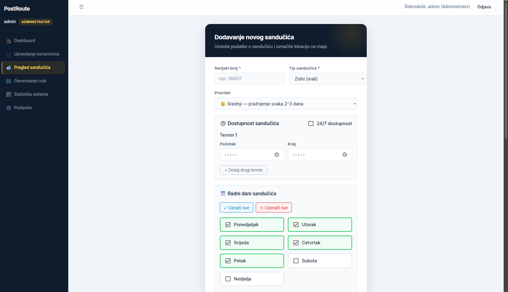

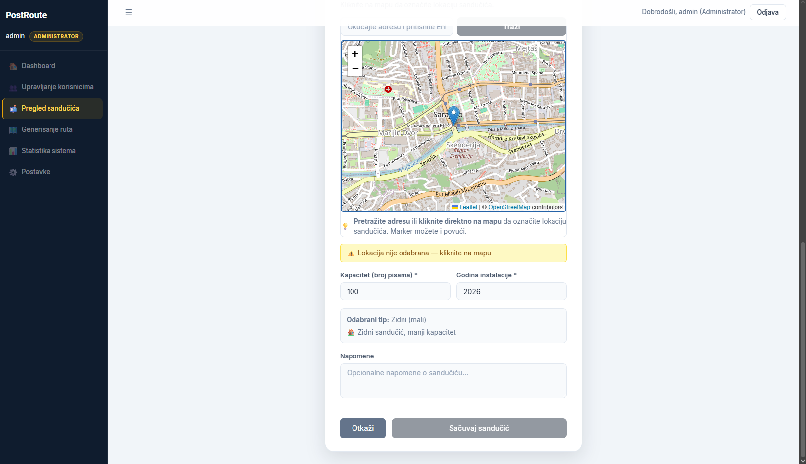

### 8.4 Pregled, pretraga i filtriranje sandučića

> Bočni meni → **Pregled sandučića** (`/admin/mailboxes`)

Sandučići se prikazuju kao kartice, s ukupnim brojem na vrhu (*"Lista sandučića — ukupno N"*).

**Dostupne akcije:**

- **Filteri**: po **Tipu**, **Prioritetu** i **Statusu**.
- **Pretraga po lokaciji**: unesite najmanje **3 znaka** (naselje, ulica ili broj) — pretraga se pokreće automatski.
- **Sortiranje** po prioritetu (dugme *Sortiranje / Po prioritetu*).
- **Poništi filtere** — vraća sve filtere na početno stanje.
- **Uredi** — otvara formu za izmjenu sandučića.
- **Mapa** — otvara prozor s lokacijom sandučića na mapi.
- **Straničenje** — 25 sandučića po stranici.

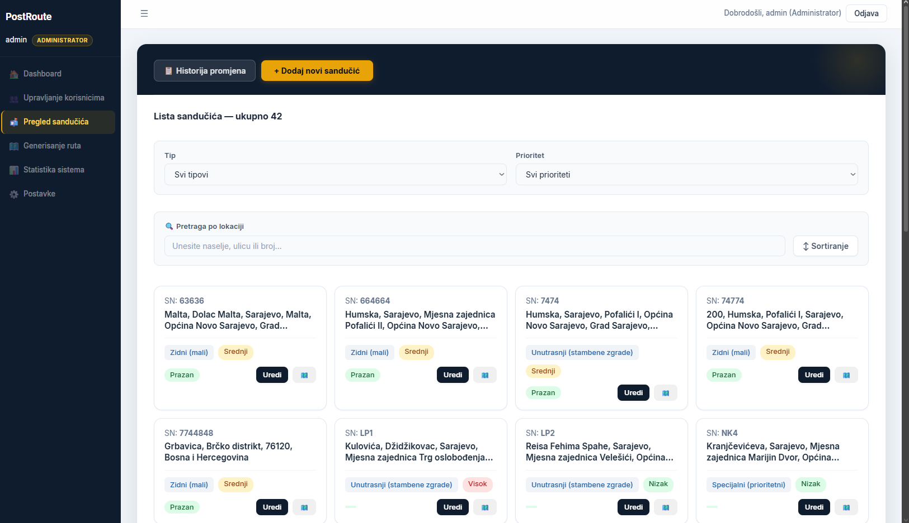

### 8.5 Izmjena sandučića i promjena prioriteta

> Lista sandučića → dugme **Uredi** na kartici sandučića

Forma za izmjenu jednaka je formi za dodavanje. Pri promjeni prioriteta dostupno je dodatno polje **Razlog izmjene prioriteta** (opcionalno) koje se bilježi u historiji.

**Očekivani rezultat:** Izmjene se spremaju, a promjena prioriteta evidentira se u **Historiji promjena** zajedno s razlogom i imenom korisnika.

### 8.6 Historija promjena prioriteta

> Lista sandučića → **Historija promjena** (`/admin/mailboxes/history`)

Prikazuje hronološki pregled svih promjena prioriteta sandučića: stara → nova vrijednost, ko je izmjenu napravio, kada, i navedeni razlog.

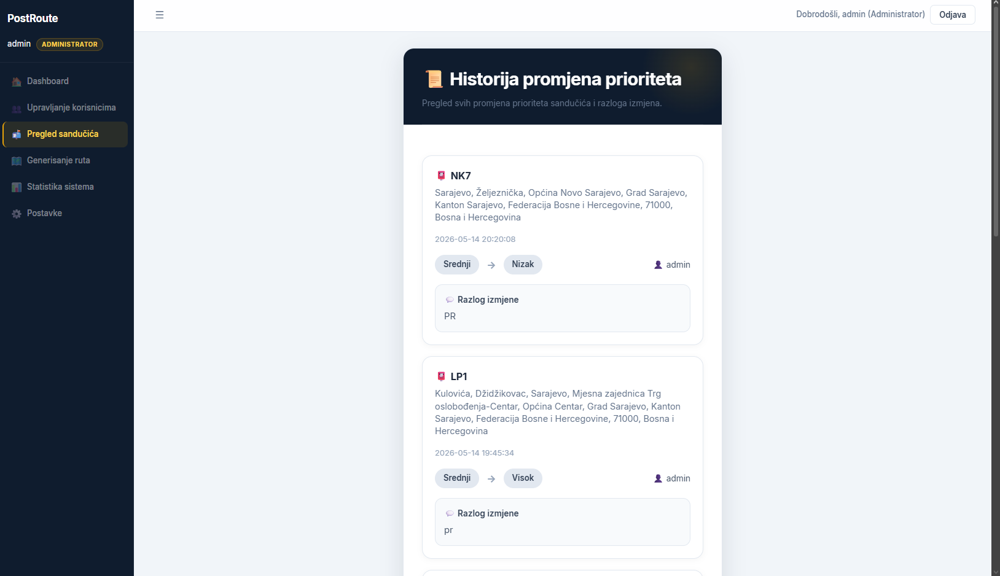

> Pored navedenog, administrator ima pristup i svim funkcijama dispečera (generisanje, praćenje, arhiva, izvještaji) — opisanim u [poglavlju 9](#9-dispečer--planiranje-i-praćenje-ruta).

---

## 9. Dispečer — planiranje i praćenje ruta

### 9.1 Generisanje dnevne rute

> Bočni meni → **Generisanje ruta** (`/admin/routes/generate`)

**Koraci:**

1. Odaberite **Poštara** iz padajuće liste.
2. Odaberite **Datum rute**.
3. Postavite **Planirano vrijeme početka** (npr. 08:00).
4. Kliknite **Generiši rutu**.

**Očekivani rezultat:** Sistem pokreće algoritam optimizacije i prikazuje:

- **Sažetak rute** — broj lokacija, ukupna distanca, planirano trajanje, status (*Prijedlog*), vremenski raspon i dodijeljeni poštar.
- **Mapu rute** s ucrtanim redoslijedom obilaska.
- **Hronološku listu lokacija** s adresama, prioritetima i procijenjenim vremenima dolaska.

Ako ruta premašuje standardno radno vrijeme (8 sati), prikazuje se upozorenje *"Ruta premašuje standardno radno vrijeme."*

> **Kako algoritam bira sandučiće:** uzimaju se samo aktivni sandučići čiji radni dani odgovaraju datumu i koji su "dospjeli" za obilazak prema pravilima prioriteta (visoki — svaki dan, srednji — svaka 2 dana, niski — svaka 4 dana). Rute se grade redom po prioritetu, biranjem najbližeg sljedećeg sandučića koji je dostupan u procijenjeno vrijeme dolaska.

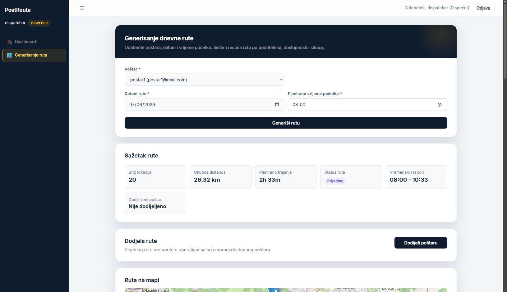

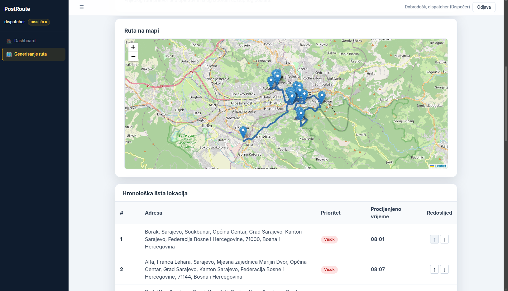

### 9.2 Ručna izmjena redoslijeda (reorder)

Na **Hronološkoj listi lokacija**, dok ruta još nije počela:

1. Koristite strelice **↑** i **↓** da pomjerite lokaciju gore ili dolje.
2. Premještene stavke označavaju se simbolom **✎** (ručno premješteno), a vremena dolaska se automatski preračunavaju.
3. Kliknite **Sačuvaj izmjene** da potvrdite, ili **Resetuj na originalni redoslijed** da poništite promjene.

**Očekivani rezultat:** Obavijest *"Izmjene redoslijeda su uspješno sačuvane."*

> Izmjena redoslijeda **nije moguća** za rute koje su u toku ili završene.

### 9.3 Dodjela rute poštaru

U sekciji **Dodjela rute** na ekranu generisanja:

1. Kliknite **Dodijeli poštaru** (ili **Promijeni poštara** ako je već dodijeljena).
2. Iz liste odaberite **dostupnog poštara**. Poštari koji već imaju rutu za taj datum prikazani su, ali onemogućeni (oznaka *"zauzet"*).
3. Kliknite **Potvrdi dodjelu**.

**Očekivani rezultat:** Status rute mijenja se u **Dodijeljena** i prikazuje se poruka *"Ruta je uspješno dodijeljena poštaru …"*. Poštar od tog trenutka vidi rutu u svom prikazu.

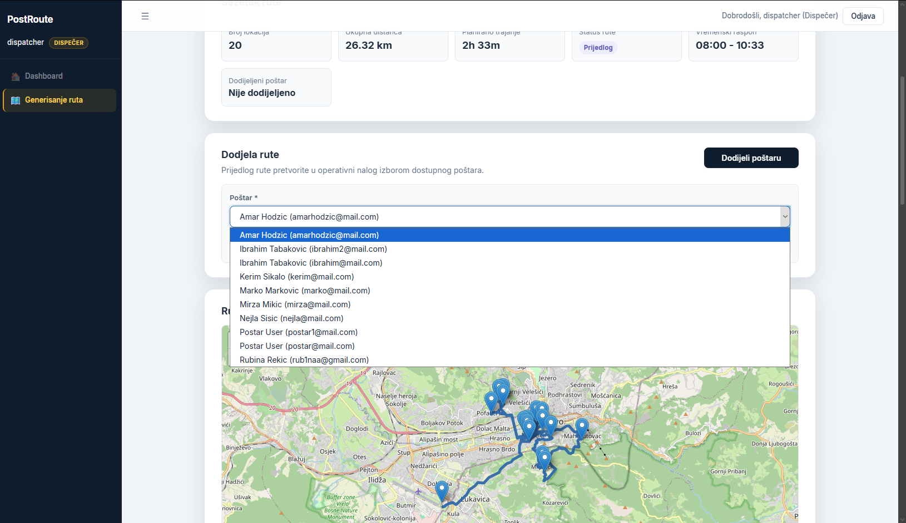

### 9.4 Praćenje realizacije ruta

> Bočni meni → **Praćenje ruta** (`/admin/routes/dashboard`)

Ekran prikazuje sve rute za odabrani datum kao kartice s napretkom realizacije.

- **Odabir datuma** — kalendar gore desno.
- **Automatsko osvježavanje** svakih 30 sekundi (vidljiv odbrojavač *"Osvježava za Xs"*); moguće i ručno klikom na **↻**.
- **Sažetak po statusu** i **filteri**: U toku, Dodijeljena, Planirana, Završena, Otkazana.
- Svaka kartica prikazuje poštara, napredak (npr. *3/8 obrađeno*), distancu, trajanje i listu sandučića sa statusom.
- Sandučići koji zahtijevaju pažnju označeni su upozorenjem **⚠**; klikom na takvu stavku otvaraju se detalji problema.
- **Otvori detalje →** vodi na potpune detalje rute.

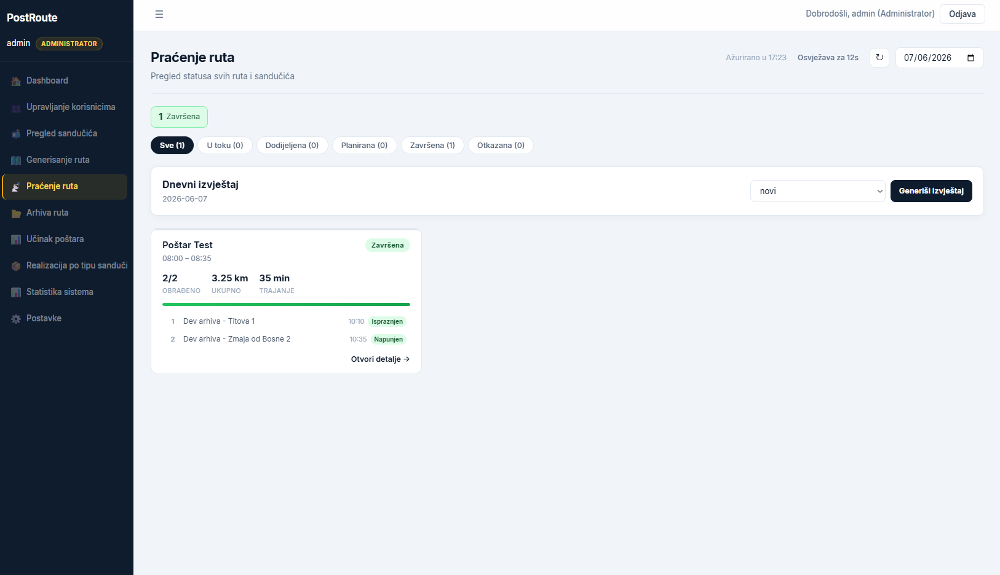

### 9.5 Dnevni izvještaj rute (PDF)

Na ekranu **Praćenje ruta**, u panelu **Dnevni izvještaj**:

1. Odaberite **poštara**.
2. Kliknite **Generiši izvještaj** — prikazuje se pregled (ukupno/obrađeno/nedostupno/nije posjećeno/realizacija %).
3. Kliknite **Preuzmi PDF** za štampanje ili spremanje izvještaja.

**Očekivani rezultat:** Otvara se izvještaj spreman za štampu/PDF. Ako je realizacija ispod 80%, prikazuje se upozorenje.

### 9.6 Arhiva ruta

> Bočni meni → **Arhiva ruta** (`/admin/routes/archive`)

Prikazuje historijske rute u tabeli s filterima: **Od datuma**, **Do datuma**, **Poštar**. Za svaku rutu vide se datum, poštar, status, broj tačaka, udaljenost/trajanje i vrijeme. Dugme **Detalji** otvara potpun prikaz arhivirane rute. Straničenje: 20 po stranici.

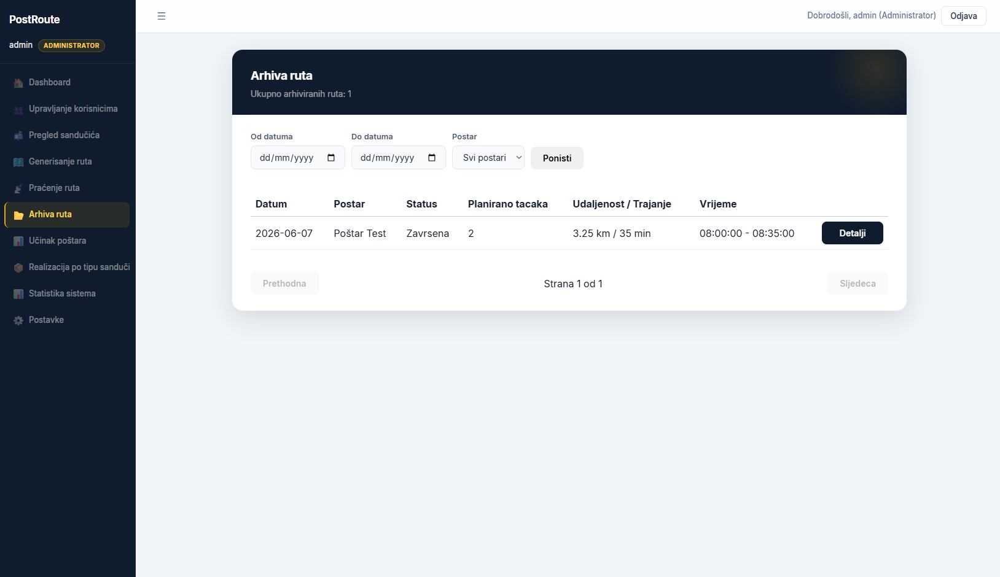

---

## 10. Poštar — rad na terenu

### 10.1 Pregled današnje rute

> Bočni meni → **Moja današnja ruta** (`/worker/route`)

Poštar vidi rutu koja mu je dodijeljena za današnji dan, sa:

- **zaglavljem** s datumom i statusom rute (*Dodijeljena / U toku / Završena*),
- **sažetkom rute**,
- **interaktivnom mapom** (klik na marker prikazuje detalje sandučića),
- **listom sandučića** poredanih po redoslijedu obilaska.

Ako nema dodijeljene rute, prikazuje se poruka *"Nema dodijeljene rute za danas"*.

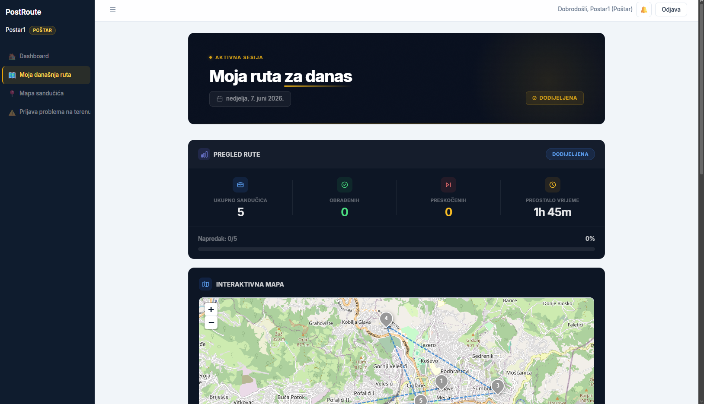

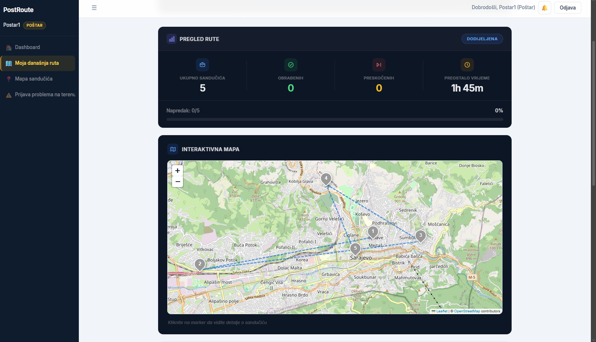

### 10.2 Ažuriranje statusa sandučića

Za svaki sandučić u listi, kada stignete na lokaciju:

1. U dijelu **Označi kao obrađen** kliknite na odgovarajuće dugme:
   - **Napunjen** — sandučić je napunjen poštom,
   - **Ispraznjen** — sandučić je ispražnjen.

**Očekivani rezultat:** Prikazuje se obavijest *"Status sandučića ažuriran: <status>"*, stavka dobija oznaku **✓ Obrađen** i vrijeme evidencije. Status se zaključava — daljnja izmjena nije moguća (*"Status je već evidentiran. Kontaktirajte dispečera za ispravku."*).

Kada svi sandučići budu obrađeni, ruta automatski prelazi u status **Završena**.

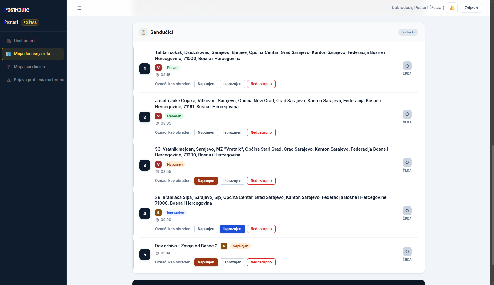

### 10.3 Prijava nedostupne lokacije

Ako sandučiću ne možete pristupiti:

1. Kliknite **Nedostupno** na stavci sandučića.
2. Odaberite **Razlog nedostupnosti**: *Zaključan pristup, Sandučić oštećen, Privatni posjed nedostupan, Prirodna prepreka* ili *Ostalo*.
3. Ako odaberete *Ostalo*, upišite napomenu (do 200 znakova).
4. Kliknite **Potvrdi nedostupnost**.

**Očekivani rezultat:** Stavka se označava kao **✕ Nedostupan**, prikazuje se upozorenje *"Sandučić označen kao nedostupan — razlog: …"*, a problem se automatski prosljeđuje dispečeru na obradu (vidi [poglavlje 11](#11-upravljanje-problematičnim-lokacijama)).

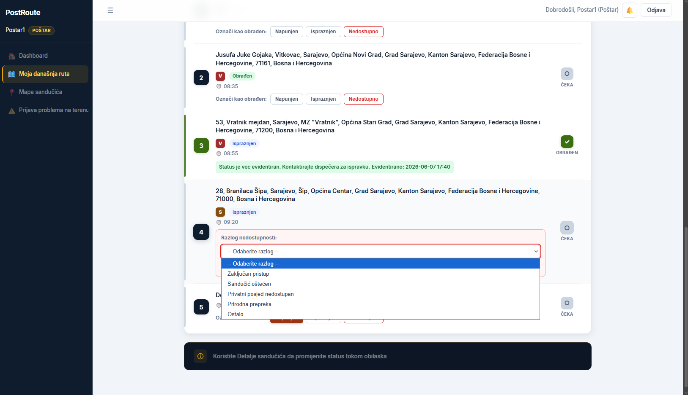

---

## 11. Upravljanje problematičnim lokacijama

Kada poštar prijavi nedostupnu lokaciju, kreira se **problem (issue)** koji dispečer/administrator rješava.

> Pristup: **Praćenje ruta** → klik na sandučić označen **⚠**, ili direktno preko detalja problema (`/admin/issues/:id`).

Ekran **Problematična lokacija** sadrži:

- **Informacije o problemu** — adresa, serijski broj, ko je prijavio, datum, razlog nedostupnosti i aktuelna dodijeljena akcija,
- **Dodjelu akcije**,
- **Komunikaciju** (komentari između poštara i dispečera),
- **Historiju aktivnosti** (vremenska linija svih događaja).

### 11.1 Primjer toka: dispečer rješava problem

**Primjer:** *Kao dispečer, da bih riješio prijavljeni problem, uradim sljedeće korake:*

1. Otvorim detalje problematične lokacije.
2. U sekciji **Dodjela akcije** odaberem akciju:
   - **Ponovni pokušaj** — poštar neka pokuša ponovo,
   - **Drugi poštar** — dodjela drugom poštaru (tada biram poštara iz liste),
   - **Odgoda za sutra** — lokacija se obilazi sljedeći dan.
3. Kliknem **Dodijeli akciju**.
4. Po potrebi dodam **komentar** s instrukcijama i kliknem **Pošalji komentar**.
5. Kada je problem riješen, kliknem **Označi kao riješen**. Ako lokacija ima prijavljen razlog nedostupnosti, sistem traži da označim finalni status sandučića (**Napunjen** ili **Ispraznjen**), pa kliknem **Potvrdi i riješi**.

**Očekivani rezultat:** Status problema mijenja se u **Riješen**, dodijeljena akcija i svi komentari bilježe se u **Historiji aktivnosti**, a status sandučića se ažurira. Nakon rješavanja, polja za dodjelu akcije i komentare se zaključavaju.

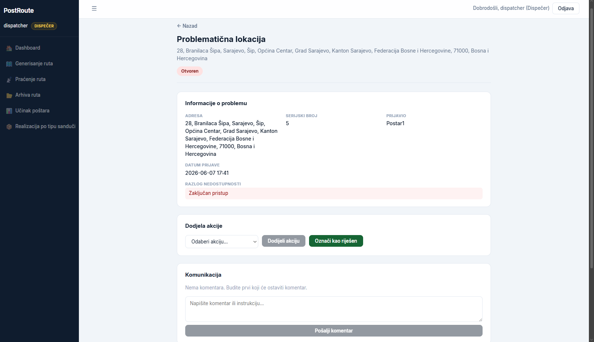

> **Poštarev prikaz problema:** Poštar može otvoriti detalje vlastitog problema (`/worker/issues/:id`) i pratiti komunikaciju, ali ne može dodjeljivati akcije ni rješavati problem — to radi dispečer/administrator.

---

## 12. Izvještaji

### 12.1 Izvještaj o učinku poštara

> Bočni meni → **Učinak poštara** (`/admin/reports/postman-performance`)

**Koraci:**

1. Odaberite period (**Od datuma** – **Do datuma**).
2. Kliknite **Prikaži izvještaj** (dugme **Resetuj period** vraća na tekući mjesec).

**Očekivani rezultat:** Prikazuje se:

- **Sažetak** — broj poštara, dodijeljeno, ispražnjeno, nerealizovano, prosjek tima,
- **Stubni grafikon** poređenja uspješnosti,
- **KPI tabela** (dodijeljeni sandučići, uspješno ispražnjeno, nerealizovano, uspješnost %, broj završenih ruta) — klik na ime poštara otvara detalje pojedinačnih ruta,
- dugme **Export CSV** za preuzimanje izvještaja kao `.csv`.

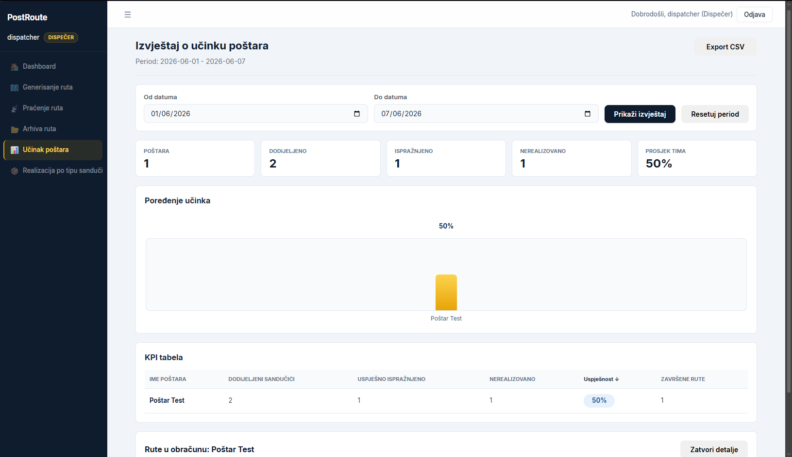

### 12.2 Realizacija po tipu sandučića

> Bočni meni → **Realizacija po tipu sandučića** (`/admin/reports/mailbox-type-realization`)

Prikazuje koliko su uspješno realizovani obilasci grupisani po **tipu sandučića** za odabrani period — broj planiranih pražnjenja, uspješnih pražnjenja, prijavljenih problema i stopu neuspjeha po tipu. Korisno za uočavanje koji tipovi sandučića najčešće prave probleme na terenu.

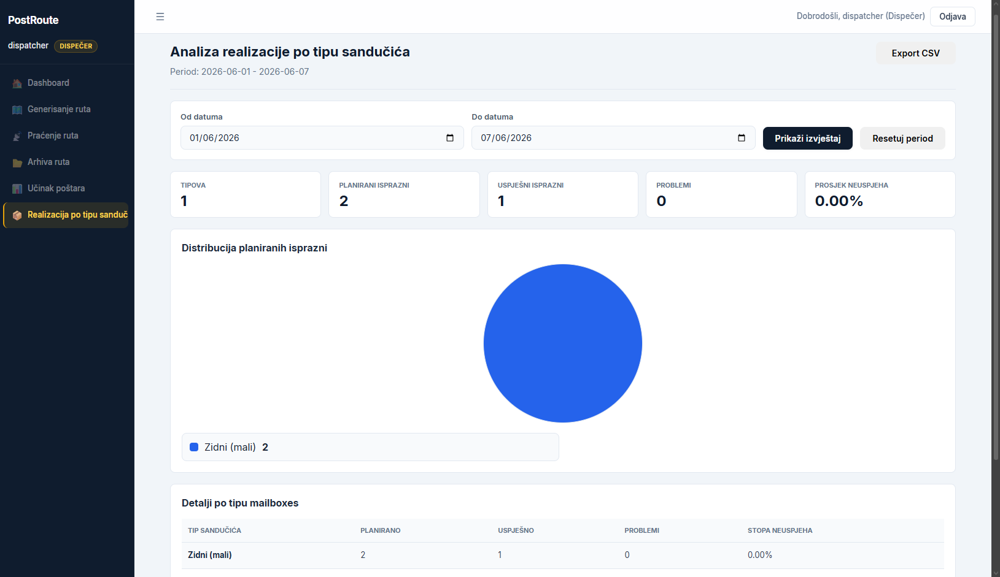

---

## 13. Sigurnosne funkcionalnosti

### 13.1 Zaključavanje računa
Nakon više uzastopnih neuspješnih pokušaja prijave, račun se **automatski zaključava** radi zaštite od neovlaštenog pristupa. Zaključan korisnik se ne može prijaviti dok ga administrator ne otključa.

### 13.2 Kontrola pristupa po ulozi
Svaka stranica i akcija zaštićene su prema ulozi. Ako pokušate otvoriti stranicu na koju nemate pravo, sistem vas vraća na Dashboard uz poruku *"Pristup odbijen — Nemate potrebne privilegije za pregled ove stranice."*

### 13.3 Obavezna promjena početne lozinke
Novokreirani korisnici moraju promijeniti privremenu lozinku pri prvoj prijavi prije nego dobiju pristup ostatku sistema.

### 13.4 Istek sesije
Iz sigurnosnih razloga sesija ističe nakon perioda neaktivnosti (oko 30 minuta), nakon čega je potrebna ponovna prijava.

### 13.5 Evidencija sigurnosnih događaja
Sistem bilježi pokušaje prijave i neovlaštene pristupe (sigurnosni log) za potrebe nadzora.

---

## 14. Ograničenja sistema i šta korisnik ne može raditi

### 14.1 Opća ograničenja sistema (MVP)

- **Nema offline načina rada** — potrebna je stalna internet konekcija.
- **Nema nativne mobilne aplikacije** — koristi se isključivo responzivni web.
- **Nema GPS praćenja kretanja uživo** — bilježi se samo trenutak promjene statusa na lokaciji.
- **Nema dinamičkog re-rutiranja prema saobraćaju** — rute ne uzimaju u obzir gužve i radove na putu.
- **Fiksne dnevne rute** — jednom generisana ruta je statična za taj radni dan.
- **Polazna tačka (depo) je fiksna** — centar Sarajeva.
- **Maksimalno 50 lokacija po ruti.**
- **Jedan poštar = jedna ruta po danu** — poštaru se ne može dodijeliti druga ruta za isti datum.
- **Mape se oslanjaju na OpenStreetMap** — preciznost zavisi od ažurnosti tog servisa.
- **Optimizacija koristi heuristiku "najbliži susjed"** — rezultat je dobar, ali ne nužno matematički optimalan.

### 14.2 Šta korisnik ne može raditi

| Korisnik | Ne može |
|---|---|
| **Bilo koji korisnik** | Sam se registrovati; promijeniti tuđi račun; pristupiti dijelovima izvan svoje uloge |
| **Poštar** | Generisati, dodjeljivati ili mijenjati redoslijed ruta; kreirati/uređivati sandučiće ili korisnike; rješavati prijavljene probleme; promijeniti **već evidentiran** status sandučića (treba kontaktirati dispečera) |
| **Dispečer** | Kreirati ili uređivati korisničke račune; kreirati ili uređivati sandučiće (to radi administrator) |
| **Dispečer/Administrator** | Mijenjati redoslijed rute koja je **u toku** ili **završena**; dodijeliti rutu poštaru koji već ima rutu tog dana; ponovo dodijeliti rutu koja je već u toku |

---

## 15. Često postavljana pitanja (FAQ)

**P: Kako da dobijem korisnički račun?**
O: Račune kreira administrator. Obratite se administratoru koji će vam kreirati nalog i dati privremenu lozinku.

**P: Zaboravio/la sam lozinku — šta da radim?**
O: Sistem u MVP fazi nema samostalni reset lozinke putem emaila. Obratite se administratoru.

**P: Račun mi je zaključan. Kako da ga otključam?**
O: Račun se zaključava nakon više neuspjelih prijava. Otključavanje vrši administrator.

**P: Zašto poštaru nije generisana ruta?**
O: Ruta se generiše samo ako postoje aktivni sandučići koji odgovaraju datumu (radni dani), pravilima prioriteta i dostupnosti. Provjerite imate li unesene i aktivne sandučiće za taj dan.

**P: Pogriješio/la sam status sandučića na terenu. Mogu li ga ispraviti?**
O: Ne direktno — jednom evidentiran status se zaključava. Kontaktirajte dispečera koji može riješiti situaciju kroz upravljanje problemom.

**P: Koliko brzo dispečer vidi promjenu statusa na terenu?**
O: Dashboard za praćenje osvježava se automatski svakih 30 sekundi, pa se promjena vidi gotovo odmah (uz moguće kratko kašnjenje).

**P: Mogu li poštaru dodijeliti dvije rute u istom danu?**
O: Ne. Sistem dozvoljava jednu rutu po poštaru po danu. Poštari koji već imaju rutu prikazani su kao "zauzeti".

**P: Mogu li izmijeniti redoslijed već započete rute?**
O: Ne. Redoslijed se može mijenjati samo dok je ruta u statusu *Prijedlog* ili *Dodijeljena*, prije nego što obilazak počne.

---

*PostRoute — Sistem za optimizaciju ruta punjenja i pražnjenja poštanskih sandučića*
*Za tehničku podršku obratite se administratoru sistema.*
